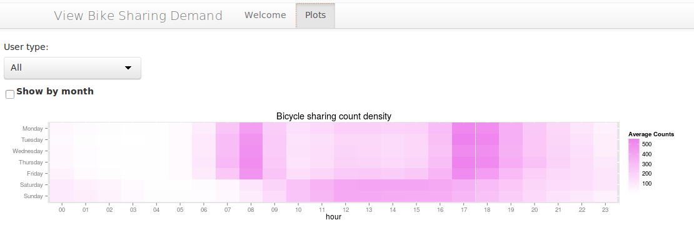
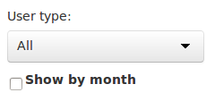

Background
----------

This is a shiny application for analyzing the Kaggle's dataset for the
[bike sharing demand
competiton](https://www.kaggle.com/c/bike-sharing-demand). The objective
of the competition is to provide accurate forecasts of the demand of
bicycles for the Capital Bikeshare program in Washington D.C. for the
given dates. The forecast should be based on historical patterns and
weather data.

App
---

Before building a model, it would be interesting to know, how the demand
changes at the different days of the week and the time of the day. We
might also want to know if it changes during the year and how.

This is application is the tool to answer this questions, by providing a
heatmap of average demanded bikes during the time of the day and day of
the week.

Options
-------

The application has the following options:

The user type select allows to plot the demand by user type. \* All:
plots all the demand \* Casual: plots the demand from unregistered users
\* Registered: plots the demand of the users that were already
registered in the program.

The "show by month" checkbox allows to plot the heatmap by month of the
year.

Credits
-------

The application is inspired in [this
thread](https://www.kaggle.com/c/bike-sharing-demand/forums/t/10510/a-simple-model-for-kaggle-bike-sharing/55513)
from Kaggle's forum.
